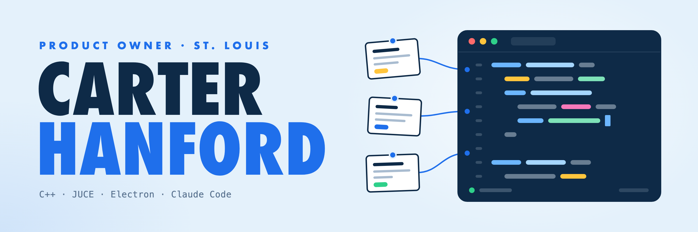

I'm a Product Owner in St. Louis who also writes code. At work I own the backlogs for three development teams on a B2B SaaS learning platform, and I stay close to the build: I design the product and UX flows, prototype features before they go into development, and work through the build with our engineers in Claude Code. I led an AI video generation product from the first brief through launch.

Outside of work I program for fun. I build audio plugins (AU and VST3) in C++ with JUCE, plus desktop apps in Electron. I use Claude Code almost every day, and the two repos below are how I've set it up to run like a team.

### Featured

**[claude-code-team-playbook](https://github.com/carter-hanford/claude-code-team-playbook)** 
How I run five Claude Code sessions as a standing team. Each session owns a lane, they coordinate through shared contract files, work moves through numbered gates, and nothing ships until I sign off. Includes the lessons that shaped it and templates to start your own. All 5 teams can work autonomously and delegate tasks to one another.

**[claude-context-library](https://github.com/carter-hanford/claude-context-library)** 
A personal knowledge base for myself built on a claude agent. My raw notes go in, a cited wiki comes out, and every claim traces back to the file it came from. Comes with an Electron app that shows the library live and runs the ingest through headless Claude Code. Helps

### Tools I use

C++ and JUCE · JavaScript and Electron · Python and R · Git and GitHub Actions · Claude Code · Azure DevOps and Jira

### Before product

I have an M.A. in Computational Sociology from Saint Louis University, where I was a graduate teaching assistant for statistics and machine learning. The older repos here are from that work: spatial analysis in R, web maps, and machine learning notebooks. Before that I played Division I baseball at SLU.

### Find me

[LinkedIn](https://www.linkedin.com/in/carter-hanford)
